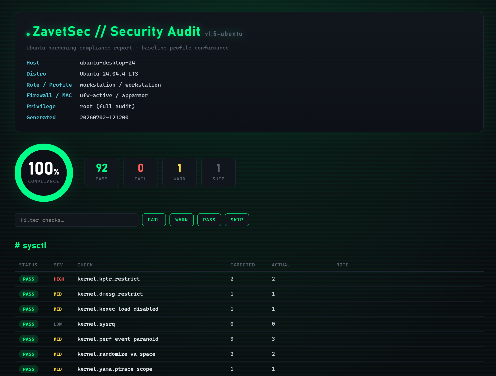

# ZavetSec-Harden-Ubuntu

**Single-file Ubuntu security hardening and compliance audit — no Ansible, no Python, no dependencies.**


-00cc6a)


**Highlights**

- ✅ Dry-run by default — nothing changes until you say so
- ✅ Automatic, one-command rollback
- ✅ Live compliance **audit** (checks the running system, not just config files)
- ✅ TXT **and** styled HTML reports — self-contained, no external requests
- ✅ Role-aware profiles (server / workstation / container-host)
- ✅ Anti-lockout guards on SSH and the firewall
- ✅ Automatic security patching (`unattended-upgrades`) and `fail2ban` out of the box
- ✅ Ubuntu 20.04 / 22.04 / 24.04 — Server & Desktop, version-aware (yescrypt, faillock, sshd option names)
- ✅ Zero external dependencies (just Bash + coreutils)



A pragmatic, CIS/STIG-aligned baseline you can actually drop onto a box and trust. It **detects** the host, picks a role-appropriate **profile**, and either **audits** current compliance (read-only, with reports) or **enforces** the baseline with full backup and one-command rollback. Default mode is dry-run, and the two areas that can strand you — SSH and the firewall — have explicit anti-lockout guards.

```
 11 hardening modules  ·  90+ live audit checks  ·  4 role profiles
 Ubuntu 20.04 / 22.04 / 24.04  ·  one Bash file  ·  zero dependencies
 dry-run by default  ·  automatic rollback  ·  TXT + HTML reports
```

```
 detect host ──▶ select profile ──▶ audit (read-only, scored report)
                                        │
                                        ▼
                              apply (backup every change)
                                        │
                                        ▼
                              rollback (one command, full revert)
```

Every release is exercised on real VMs through the full `apply → reboot → audit → rollback → apply` cycle before it ships. That process has caught (and fixed) things static review never would: sshd drop-in ordering losing to `cloud-init`, ufw silently reverting `sysctl.d` values on start, a `pipefail`+`grep -q` SIGPIPE race producing phantom "service absent" results, and apport re-enabling `suid_dumpable` after every boot. The changelog in the script header documents all of it.

---

## Table of contents

- [Why](#why)
- [Features](#features)
- [Non-goals](#non-goals)
- [Safety model](#safety-model)
- [Requirements](#requirements)
- [Install](#install)
- [Quick start](#quick-start)
- [Modes](#modes)
- [Audit &amp; reports](#audit--reports)
- [Profiles](#profiles)
- [Modules](#modules)
- [Command-line reference](#command-line-reference)
- [Tunables](#tunables)
- [How it works](#how-it-works)
- [Rollback](#rollback)
- [Philosophy](#philosophy)
- [FAQ &amp; caveats](#faq--caveats)
- [License](#license)

---

## Why

Most Linux hardening scripts try to support every distribution, accumulate years of compatibility branches nobody re-tests, and eventually become hard to trust with root. **ZavetSec-Harden-Ubuntu takes the opposite approach: Ubuntu only, role-aware, audit-first.**

- **Ubuntu only** — uses `apt`, `ufw`, AppArmor, `pam-auth-update`, `ssh.socket`, and apport directly and correctly, instead of untested cross-distro branches. It even knows the release-specific traps: yescrypt exists only from 22.04, `pam_faillock` needs PAM ≥ 1.4 (absent on 20.04), sshd 8.2 on focal rejects `KbdInteractiveAuthentication`, cloud images ship a `50-cloud-init.conf` that overrides carelessly-named drop-ins, and stock ufw actively resets `log_martians` on every start.
- **Role-aware** — a container host must keep IP forwarding on and its firewall off; a workstation must keep printing, removable media, apport and SLAAC. Profiles encode those trade-offs.
- **Audit-first** — measure a host's compliance and produce a shareable report *before* you change anything.

**How it relates to the tools you already know** — different jobs, deliberately:

| | ZavetSec-Harden | Lynis | OpenSCAP | Ansible roles |
|---|:---:|:---:|:---:|:---:|
| Audit with score | ✅ | ✅ | ✅ | ❌ |
| Enforce the baseline | ✅ | ❌ (advice only) | partial (remediation profiles) | ✅ |
| Dry-run preview of every change | ✅ | n/a | ❌ | partial (`--check`) |
| One-command rollback | ✅ | n/a | ❌ | ❌ |
| Single file, zero dependencies | ✅ | ❌ | ❌ | ❌ (needs Ansible + inventory) |
| Certified compliance reporting | ❌ | ✅ | ✅ | ❌ |
| Cross-distro | ❌ (by design) | ✅ | ✅ | varies |

Use Lynis or OpenSCAP when an auditor needs a certified report; use this when you need a box hardened *and* provably revertible. They pair well — this project's own release testing uses Lynis as the independent second opinion.

---

## Features

The things you care about first:

- **Dry-run by default** — see every change before it happens, including every firewall and service action
- **Automatic rollback** — one script reverts the whole run; a pre-existing ufw ruleset is snapshotted and restored, never just disabled
- **Compliance audit** — PASS/FAIL/WARN/SKIP against the profile baseline, with a score
- **HTML reports** — self-contained (no external fonts or requests — an audit report must not phone home), styled, with a live filter and a failed-checks panel
- **Role-aware profiles** — `defaults`, `server`, `workstation`, `container-host`
- **Patching &amp; brute-force defence** — `unattended-upgrades` enforced (opt-out), `fail2ban` with an update-proof `jail.local`
- **Zero dependencies** — Bash + coreutils, present on every Ubuntu install

Under the hood:

- **Detection layer** — Ubuntu version, init, container, firewall backend, AppArmor, GUI/headless, live SSH port(s) (IPv6-safe parsing), and `ssh.socket` activation (relevant on 24.04).
- **Eleven modules** — kernel/network `sysctl`, SSH, password/lockout policy, firewall, auditd, filesystem, service reduction, extras (patching/fail2ban/accounting), AppArmor, and misc.
- **Anti-lockout** — SSH crypto negotiated only from what the installed `sshd` supports (`ssh -Q`); config validated with `sshd -t` and the *previous* drop-in restored from backup on failure; password auth never disabled unless keys exist; firewall always permits the detected SSH port + loopback + established before default-deny; sudoers changes validated with `visudo` and auto-removed if rejected; faillock PAM wiring refuses to run where `pam_faillock` doesn't exist.
- **Idempotent &amp; verified** — safe to run repeatedly; every in-place edit is verified after writing and logs `ERR` instead of a false `OK` if it didn't land. Commented lines (including documentation comments in `login.defs`) are never rewritten.

---

## Non-goals

ZavetSec-Harden-Ubuntu intentionally does **not**:

- rewrite `/etc/fstab` automatically (advisory only)
- force AppArmor profiles into enforce mode
- disable user namespaces (would break snap, rootless containers, browser sandboxes)
- disable or remove snap / squashfs
- flip SELinux — this is an AppArmor/Ubuntu tool
- harden non-Ubuntu distributions
- replace certified scanners like Lynis or OpenSCAP
- set a GRUB password (physical-access threat model — decide that per site)
- repartition disks (separate `/home`, `/tmp`, `/var` are install-time decisions)
- configure remote log shipping (environment-specific by nature)
- install a malware scanner or AIDE (heavyweight; may appear later as explicit opt-ins)

Being explicit about the boundaries is part of the point: the tool does a well-defined job and gets out of the way. When Lynis suggests one of the above, that's the intended division of labour, not a gap.

---

## Safety model

1. **Dry-run by default.** Nothing changes unless you pass `--apply` — and dry-run shows *everything*, including firewall and service actions.
2. **Backups before every change.** Originals are copied into `state-dir/backup`, preserving paths. Dry-run never writes backups or rollback entries.
3. **Auto-generated rollback.** `sudo bash <state-dir>/rollback.sh` reverts the whole run. If ufw was active *before* the run, rollback restores your previous ruleset instead of disabling the firewall.
4. **Detect before act.** Role, firewall backend, MAC, and the live SSH port drive behaviour.
5. **Anti-lockout guards** on the modules that can strand you:
   - **SSH** writes a drop-in named `00-…` so it wins under sshd's first-match-wins semantics (a higher number silently loses to `50-cloud-init.conf` on cloud images); filters ciphers/KEX/MACs through `ssh -Q`; runs `sshd -t` and restores the previous drop-in on failure; reloads (never kills) `sshd`; is aware of `ssh.socket` on 24.04; uses `ChallengeResponseAuthentication` on focal where the modern option name doesn't exist yet.
   - **Firewall** allows SSH/loopback/established *before* default-deny, and is **off on `container-host`** so it never clobbers Docker's own nftables chains.
   - **Auth** wires faillock via native `pam-auth-update` with the canonical `preauth / authfail / authsucc` stack (opt-in), and *refuses* to wire it on releases without `pam_faillock` (20.04) instead of writing a broken PAM stack.
   - **Sudo** hardening is validated with `visudo -c` and removed instantly if rejected — sudo cannot be bricked by this tool.
6. **Never blind-enforce.** AppArmor is enabled but profiles aren't force-`enforce`d. Destructive options (`noexec /tmp`, IPv6 off, `usb-storage` off, `ptrace_scope=2`, audit immutable `-e 2`, faillock PAM wiring) are opt-in.

> Always keep a second root session open the first time you run `--apply` on a remote host.

---

## Requirements

**The script refuses to run on non-Ubuntu systems unless you pass `--force`.** Derivatives (Mint, Pop!_OS, etc.) are detected and allowed with a warning.

- Ubuntu **20.04 / 22.04 / 24.04 LTS** (Server or Desktop)
- Bash 4+ and coreutils (already present)
- **root** for `--apply` and for a *complete* audit (`sshd -T`, `ufw`, `auditctl`, file permissions). Detection and a partial audit work without root — and both the console and the reports display a prominent warning that a non-root score is unreliable.

---

## Install

It's one file — that's the entire installation.

```bash
# git
git clone https://github.com/zavetsec/ZavetSec-Harden-Ubuntu
cd ZavetSec-Harden-Ubuntu && chmod +x zavetsec-harden-ubuntu.sh

# curl
curl -fsSLO https://raw.githubusercontent.com/zavetsec/ZavetSec-Harden-Ubuntu/main/zavetsec-harden-ubuntu.sh

# wget
wget https://raw.githubusercontent.com/zavetsec/ZavetSec-Harden-Ubuntu/main/zavetsec-harden-ubuntu.sh

chmod +x zavetsec-harden-ubuntu.sh
```

**Verify integrity before running** — this is a security tool that will run as root, and a file mangled in transit (encoding, line endings, truncation) can fail in non-obvious ways:

```bash
sha256sum -c SHA256SUMS
bash -n zavetsec-harden-ubuntu.sh && echo OK
```

---

## Quick start

```bash
# Audit compliance (read-only) → TXT + HTML reports
sudo ./zavetsec-harden-ubuntu.sh --audit

# Enforce the baseline (auto profile from detected role)
sudo ./zavetsec-harden-ubuntu.sh --apply
```

<details>
<summary>More commands</summary>

```bash
# See what the tool detects about this host
sudo ./zavetsec-harden-ubuntu.sh --detect-only

# Preview enforcement without changing anything (dry-run, the default)
sudo ./zavetsec-harden-ubuntu.sh

# Enforce a specific profile / role
sudo ./zavetsec-harden-ubuntu.sh --apply --profile server
sudo ./zavetsec-harden-ubuntu.sh --apply --role container-host

# Only / skip specific modules
sudo ./zavetsec-harden-ubuntu.sh --apply --only ssh,firewall
sudo ./zavetsec-harden-ubuntu.sh --apply --skip firewall

# Audit into a specific directory, HTML only
sudo ./zavetsec-harden-ubuntu.sh --audit --report-dir /var/log/zs-audit --format html
```

</details>

---

## Modes

| Mode | Flag | Root | Changes system | Output |
|------|------|:----:|:--------------:|--------|
| Detect | `--detect-only` | optional | no | detection summary |
| Audit | `--audit` (alias `--check`) | recommended | no | console + TXT + HTML report |
| Dry-run | *(default)* | optional | no | per-change "would do" log |
| Enforce | `--apply` | **required** | yes | applied changes + backups + rollback |

---

## Audit &amp; reports

Audit reads the **live** system state — not just config files — and compares it to the selected profile's baseline: kernel/network via `sysctl -n`, effective SSH config via `sshd -T`, `ufw status`, `aa-status`, `auditctl -l`, mount options via `findmnt`, real permissions via `stat`, service state, installed packages.

Each check yields **PASS / FAIL / WARN / SKIP** with a **HIGH / MED / LOW** severity, and a compliance score (`PASS / (PASS + FAIL)`).

```
  AUDIT SUMMARY
  Compliance score: 100%  (PASS:92 FAIL:0 WARN:1 SKIP:1)
[OK  ] TXT report:  ./zavetsec-audit-web01-20260702-121200.txt
[OK  ] HTML report: ./zavetsec-audit-web01-20260702-121200.html
```

Reports go to the current directory by default (`--report-dir` to change) as `zavetsec-audit-<host>-<timestamp>.{txt,html}`; pick `--format txt|html|both` (default `both`).

- **TXT** — grouped by category, summary line, explicit failed-check list with the exact remediation command. Good for logs, cron, and diffing over time.
- **HTML** — a self-contained page (see screenshot above): compliance gauge, PASS/FAIL/WARN/SKIP tallies, a red panel listing every failure with expected-vs-actual values, per-category tables with severity badges, and a live filter/search box. No external fonts, scripts, or requests — an audit artifact must not phone home.
- **Non-root runs are flagged.** Without root, `sshd -T`/`ufw`/AppArmor checks SKIP, so both report formats display a prominent *"NON-ROOT AUDIT — SCORE IS UNRELIABLE"* warning rather than letting a hollow 100% mislead anyone.

Because enforcement and audit share the same baseline, a FAIL list is exactly what `--apply` with the same profile will fix. Context-dependent values are reported honestly: e.g. on `workstation`, where apport is deliberately kept, `fs.suid_dumpable` shows as `SKIP (apport-managed)` instead of a false FAIL — apport resets it to `2` on every boot by design.

---

## Profiles

The role is auto-detected (`container` → `workstation` if a GUI is present → otherwise `server`; a `server` running `dockerd`/`kubelet` is promoted to `container-host`) or set with `--role`. `defaults` is the base; each named profile overrides only deltas.

| Setting | `defaults` | `server` | `workstation` | `container-host` |
|---|:---:|:---:|:---:|:---:|
| Firewall default-deny | off | **on** | **on** | **off** (runtime owns rules) |
| IP forwarding | off | off | off | **on** (required) |
| `ptrace_scope` | 1 | 2 | 1 | 1 |
| Unprivileged eBPF | off | off | **kept** | **kept** (CNI/Cilium) |
| `usb-storage` | kept | disabled | kept | disabled |
| Filesystem module | on | on | on | **off** (overlayfs) |
| apport | disabled | disabled | **kept** | disabled |
| cups / avahi | — | disabled | **kept** | disabled |
| `PermitRootLogin` | prohibit-password | **no** | **no** | **no** |
| `MaxSessions` | 4 | **2** | 4 | 4 |
| Auto security upgrades | on | on | on | on |

> On `container-host`, Docker publishes ports via its own nftables rules that **bypass ufw** — the firewall module is intentionally off there, and the tool warns about it.

> `MaxSessions 4` on non-server profiles is deliberate: `2` (the Lynis ideal) breaks SSH `ControlMaster` multiplexing and VS Code Remote.

---

## Modules

Run order and one-liners:

1. **sysctl-kernel** — kernel info-leak, ASLR, ptrace, eBPF, `protected_*`, coredump hardening
2. **sysctl-network** — anti-spoofing, redirect/source-route rejection, SYN cookies; role-critical forwarding
3. **ssh** — modern crypto, `00-` drop-in (wins against cloud-init), `sshd -t` validation, anti-lockout, `ssh.socket`-aware
4. **auth** — password ageing, version-aware hashing (yescrypt + cost / SHA512 + rounds), pwquality, faillock policy
5. **firewall** — ufw default-deny inbound, SSH-safe, pins the sysctl values ufw itself would clobber
6. **auditd** — CIS/STIG-inspired audit rule set (b64 **and** b32 arches)
7. **filesystem** — safe mount options, rare-fs blacklist (keeps squashfs)
8. **services** — disable unneeded daemons, purge legacy cleartext services, blacklist uncommon net protocols
9. **extras** — unattended-upgrades, fail2ban (+ update-proof `jail.local`), debsums, needrestart, process accounting, sysstat
10. **apparmor** — ensure enabled; never blind-enforce
11. **misc** — coredumps, apport, banners, cron allow-list, Ctrl-Alt-Del, sudo hardening, file permissions

<details>
<summary>Full module reference</summary>

| # | Module | Details |
|---|--------|---------|
| 1 | `sysctl-kernel` | `kptr_restrict`, `dmesg_restrict`, `kexec_load_disabled`, `perf_event_paranoid`, full ASLR, `yama.ptrace_scope`, unprivileged eBPF off + JIT hardening, `protected_{hardlinks,symlinks,fifos,regular}`, `dev.tty.ldisc_autoload=0`, `suid_dumpable=0` (skipped where apport is deliberately kept — apport owns it there). User namespaces are **not** disabled. |
| 2 | `sysctl-network` | reverse-path filter, ICMP redirect/source-route rejection, martian logging, broadcast-ICMP ignore, SYN cookies, `tcp_rfc1337`, IPv6 redirect/RA hardening. IP forwarding is role-critical (kept on for `container-host`). |
| 3 | `ssh` | Hardened drop-in `00-zavetsec-harden.conf` — sshd is first-match-wins, so the lowest-numbered file beats `50-cloud-init.conf` and friends. Modern KEX/ciphers/MACs (filtered by `ssh -Q`), `PermitRootLogin`, `MaxAuthTries 3`, `MaxSessions`, `LoginGraceTime`, `TCPKeepAlive no`, disabled X11/agent/TCP forwarding, `LogLevel VERBOSE`, banner. Focal-compatible option names. Validated with `sshd -t`; on failure the *previous* drop-in is restored from backup. `ssh.socket`-aware (24.04). |
| 4 | `auth` | `login.defs` (ageing, `UMASK`), version-aware hashing: `ENCRYPT_METHOD yescrypt` + `YESCRYPT_COST_FACTOR` on 22.04+, `SHA512` + `SHA_CRYPT_*_ROUNDS` on 20.04. `pwquality.conf`, `faillock.conf`. Optional faillock PAM wiring via native `pam-auth-update` using the canonical `preauth(1025) / authfail(0) / authsucc(Additional)` stack (opt-in; lockout risk); refuses on releases without `pam_faillock`. |
| 5 | `firewall` | ufw default-deny inbound; SSH/loopback/established allowed first. Fixes the active `log_martians=0` lines noble ships in `/etc/ufw/sysctl.conf` **in place** and re-runs `sysctl --system` after `ufw enable`, so `sysctl.d` wins immediately. Pre-existing ruleset snapshotted for rollback. |
| 6 | `auditd` | auditd + CIS/STIG-aligned rules for **both** `arch=b64` and `arch=b32` (identity, time, MAC, logins, perm/ownership changes, unauthorized access, mounts, deletes, module loading, privileged commands). Immutable `-e 2` opt-in. |
| 7 | `filesystem` | `nodev,nosuid,noexec` on `/dev/shm`, advisory checks for `/tmp`/`/var/tmp`, rare-fs blacklist. `squashfs` kept (snap). `noexec /tmp` and `usb-storage` off are opt-in. |
| 8 | `services` | Disables profile-listed services (avahi, rpcbind, cups, bluetooth, …), purges legacy cleartext daemons (telnet, rsh, talk, tftp, nis), blacklists uncommon network protocols (`dccp sctp rds tipc`). |
| 9 | `extras` | `unattended-upgrades` + enforced `20auto-upgrades` (security patching beats half the sysctls combined; opt-out via tune). `fail2ban` with a `jail.local` that survives package updates — a pre-existing user-managed `jail.local` is never touched. `debsums`, `apt-listchanges`, `needrestart`, `libpam-tmpdir`, `acct`, `sysstat` (collection enabled). |
| 10 | `apparmor` | Ensures AppArmor installed and enabled; reports complain-mode profiles. Never blind-`enforce`s. |
| 11 | `misc` | Disables core dumps, disables apport (servers), warning banners, cron/at allow-list (flagged as a MED risk — non-root users lose cron unless added), masks Ctrl-Alt-Del, sudo hardening (`use_pty`, `logfile`) validated with `visudo` and auto-removed if rejected, fixes permissions (`/etc/shadow` → `640 root:shadow`, `/etc/sudoers.d` → `750`). |

</details>

Run a subset with `--only` or exclude with `--skip`.

---

## Command-line reference

```
--apply                  apply changes (otherwise dry-run)
--dry-run                explicit dry-run (default)
--audit, --check         read-only compliance audit + TXT/HTML reports
--profile <name>         defaults | server | workstation | container-host
--role <name>            override the auto-detected role
--only <a,b,c>           run only these modules (by key)
--skip <a,b,c>           skip these modules
--detect-only            print the detection summary and exit
--report-dir <dir>       where to write audit reports (default: current dir)
--format <txt|html|both> audit report format (default: both)
--state-dir <dir>        logs/backups/rollback (default: /var/log/zavetsec-harden/<ts>;
                         falls back to /tmp for non-root detect/audit runs)
--force                  run even on non-Ubuntu (not recommended)
--list                   list modules in run order
--no-color               disable ANSI color
--version                print version
-h, --help               show help
```

---

## Tunables

Profiles are shell assignments in the `load_profile` function — edit them or add a new `case` branch.

- **Modules:** `ZS_ENABLE_SYSCTL_KERNEL`, `ZS_ENABLE_SYSCTL_NETWORK`, `ZS_ENABLE_SSH`, `ZS_ENABLE_AUTH`, `ZS_ENABLE_FIREWALL`, `ZS_ENABLE_AUDITD`, `ZS_ENABLE_FILESYSTEM`, `ZS_ENABLE_SERVICES`, `ZS_ENABLE_EXTRAS`, `ZS_ENABLE_APPARMOR`, `ZS_ENABLE_MISC`.
- **Password/login:** `ZS_TUNE_PASS_MAX_DAYS`, `ZS_TUNE_PASS_MIN_DAYS`, `ZS_TUNE_PASS_WARN_AGE`, `ZS_TUNE_UMASK`, `ZS_TUNE_YESCRYPT_COST`, `ZS_TUNE_SHA_ROUNDS`, `ZS_TUNE_PWQ_MINLEN`, `ZS_TUNE_PWQ_MINCLASS`, `ZS_TUNE_FAILLOCK_DENY`, `ZS_TUNE_FAILLOCK_UNLOCK`, `ZS_TUNE_ENABLE_FAILLOCK_PAM`.
- **SSH:** `ZS_TUNE_SSH_PERMIT_ROOT`, `ZS_TUNE_SSH_DISABLE_PASSWORD`, `ZS_TUNE_SSH_MAXAUTH`, `ZS_TUNE_SSH_MAXSESSIONS`, `ZS_TUNE_SSH_GRACE`, `ZS_TUNE_SSH_ALIVE_INTERVAL`, `ZS_TUNE_SSH_ALIVE_COUNT`, `ZS_TUNE_SSH_ALLOW_TCP_FWD`, `ZS_TUNE_SSH_X11`, `ZS_TUNE_SSH_TCP_KEEPALIVE`.
- **Kernel/network:** `ZS_TUNE_NET_FORWARDING`, `ZS_TUNE_PTRACE_SCOPE`, `ZS_TUNE_DISABLE_BPF_UNPRIV`, `ZS_TUNE_DISABLE_USB_STORAGE`, `ZS_TUNE_DISABLE_IPV6`, `ZS_TUNE_NET_PROTO_BLACKLIST`.
- **Extras:** `ZS_TUNE_EXTRA_PKGS`, `ZS_TUNE_AUTO_UPGRADES`, `ZS_TUNE_F2B_BANTIME`, `ZS_TUNE_F2B_FINDTIME`, `ZS_TUNE_F2B_MAXRETRY`.
- **Other:** `ZS_TUNE_TMP_NOEXEC`, `ZS_TUNE_AUDIT_IMMUTABLE`, `ZS_TUNE_DISABLE_APPORT`, `ZS_TUNE_SUDO_HARDEN`, `ZS_TUNE_FS_BLACKLIST`, `ZS_TUNE_DISABLE_SERVICES`.

---

## How it works

A single Bash file, organized into clearly separated sections:

```
zavetsec-harden-ubuntu.sh
├── logging / state          coloured logs, backup, rollback, change tracking
├── idempotent helpers       set_kv, ensure_line, write_managed, set_sysctl, apt_*, svc_*
├── audit engine             chk, a_sysctl, a_sshd, a_kv, a_file_mode, a_svc_*, …
├── detect()                 Ubuntu-focused detection
├── load_profile()           defaults + per-role deltas
├── mod_<name>()             enforcement modules  (apply / dry-run)
├── audit_<name>()           audit modules        (read-only)
├── report_txt / report_html report generators
└── main                     arg parsing, mode dispatch, run loop, summary
```

Enforcement and audit share the same baseline, so an audit's FAIL list is exactly what `--apply` will change. Adding a module means adding a `mod_<key>` and an `audit_<key>` function and listing the key in `MODULES`.

Two implementation details worth knowing, both earned the hard way:

- `set_kv` never rewrites commented lines (they're often documentation, e.g. in `login.defs`); a live line is edited in place, otherwise the value is appended (last value wins in every target format). Every write is verified afterwards — a failed edit logs `ERR`, never a false `OK`.
- Under `set -o pipefail`, `bigcommand | grep -q` is a race: `grep -q` exits on first match, the producer dies with SIGPIPE, and the pipeline goes false despite the match. The script avoids that pattern everywhere it matters — it once produced intermittent phantom *"service absent"* audit results on real hosts.

---

## Rollback

Every `--apply` run creates a timestamped state directory with backups, a log, a change list, and a rollback script:

```bash
sudo bash /var/log/zavetsec-harden/<timestamp>/rollback.sh
```

It restores backed-up files, re-enables disabled/masked services, and undoes ufw/sysctl/PAM changes from that run. If ufw was active before the run, rollback restores the pre-run ruleset (snapshotted into the backup dir) — it will not leave you with a disabled firewall you didn't ask for. Packages installed by the run that guard live sessions (fail2ban) are removed on rollback only if the run installed them.

---

## Philosophy

> Security hardening should be predictable.
>
> Every change should be visible before it happens.
>
> Every change should be reversible.
>
> Every recommendation should exist because it improves security without unnecessarily breaking Ubuntu.

And one earned in testing: **a hardening tool must never lie about what it did.** Every edit is verified after writing; failures are loud `ERR`s, dry-run output shows every action including firewall and service changes, and a non-root audit tells you its score can't be trusted.

---

## FAQ &amp; caveats

**Is this a certified compliance scanner?**
No. It's a baseline-conformance audit and enforcer. For formal CIS/STIG reporting, pair it with [Lynis](https://cisofy.com/lynis/) or `oscap`. (On a stock 24.04 desktop, applying the baseline typically moves the Lynis hardening index from ~60 to the mid-80s; the remaining suggestions are the deliberate non-goals above.)

**Will it lock me out over SSH?**
The design goes to real lengths to prevent that (drop-in config, `ssh -Q` crypto filtering, `sshd -t` with restore-from-backup, never disabling passwords without keys, always allowing the live SSH port before default-deny). Still — keep a second root session open on the first remote `--apply`.

**Why is the firewall off on container hosts?**
Docker inserts its own nftables rules that bypass ufw. Manage container-host ingress at the runtime/orchestrator/cloud-SG layer.

**Why does `fs.suid_dumpable` show SKIP on my desktop?**
The `workstation` profile deliberately keeps apport, and apport sets `suid_dumpable=2` on every boot (it needs it to intercept suid crashes). Enforcing `0` there would be a lie that lasts until the next reboot, so the tool skips it honestly and says why. On `server` (apport disabled) it's enforced and audited strictly.

**My audit shows a WARN about AppArmor complain-mode profiles — is that bad?**
On Desktop images several snap/browser profiles ship in complain mode; the WARN is informational. Review with `aa-status` and `aa-enforce` selectively — the tool won't do it blindly for you.

**Potentially disruptive options** (all opt-in): `noexec /tmp`, IPv6 off, `usb-storage` off, `ptrace_scope=2`, auditd immutable `-e 2`, faillock PAM wiring.

**Can I run it in CI?**
Yes. `--audit` needs no confirmation and exits cleanly; the TXT report diffs well across runs. `--apply` prompts for confirmation only on an interactive TTY. Non-root audit runs work (with reduced coverage, clearly flagged) and fall back to a `/tmp` state dir automatically.

---

## License

MIT. Provided as-is, without warranty. You are responsible for testing on non-production systems and keeping a rollback path before enforcing on anything you care about.

---

*ZavetSec — practical security engineering.*
